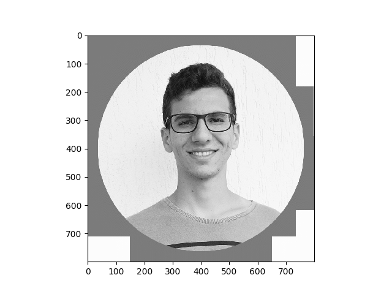

# image-de-blurring

O projeto desenvolvido trata-se de image de-blurring via minimização de quadrados mínimos. A partir de uma imagem preto e branco, produz-se a versão borrada da imagem usando um filtro gaussiano 2D e em seguida desborra-se a imagem por meio do método proposto.

## Convolução
No processamento de imagens, um kernel, matriz de convolução ou máscara é uma matriz pequena. Ele é usado para desfoque, nitidez, relevo, detecção de bordas e muito mais. Isso é feito fazendo uma convolução entre um kernel e uma imagem. Um exemplo simples de convolução trata-se da máscara para detecção de bordas na imagem.

#### Detecção de bordas por meio de máscaras de Sobel
Para obter a máscara, considera-se que cada vetor ortogonal é uma estimativa derivativa direcional multiplicada por um vetor unitário especificando a direção da derivada. A soma vetorial dessas estimativas de gradiente simples equivale a uma soma vetorial dos 8 vetores derivativos direcionais. Assim, um ponto na grade cartesiana e seus oito valores de densidade vizinhos, como mostrado:

|  |  |  |
|--|--|--|
| a | b | c |
| d | e | g |
| h | i | j |

gradiente = G = (c - g)[1, 1] + (a - i)[-1, 1] + (b - h)[0, 1]

Normalizando,
2G = (c - g)[1, 1] + (a - i)[-1, 1] + (b - h)[0, 1]

Logo,
2G = [(c - g - a + i) + 2(f - d), (c - g + a - i) + 2(b - h)]

Assim, para bordas a partir de gradientes na direção horizontal, tem-se a seguinte máscara

|  |  |  |
|--|--|--|
| -1 | 0 | 1 |
| -2 | 0 | 2 |
| -1 | 0 | 1 |

já para bordas a partir de gradientes na direção vertical, tem-se a seguinte máscara

|  |  |  |
|--|--|--|
| 1 | 2 | 1 |
| 0 | 0 | 0 |
| -1 | -2 | -1 |

Implementação:

```python
from matplotlib import pyplot as plt
from scipy.signal import convolve2d
import numpy as np
import matplotlib.cm as cm
from PIL import Image


im = Image.open('assets/pb.png')
im_grey = im.convert('L') # converter para preto e branco
im_array = np.array(im_grey)
plt.imshow(im_array, cmap=cm.Greys_r)
plt.savefig('assets/edge_before.png')


kernel = np.array([[1,2,1],[0,0,0],[-1,-2,-1]], np.float32)
result = convolve2d(im_array, kernel)
plt.imshow(result, cmap=cm.Greys_r)
plt.savefig('assets/edge_after.png')
```

Dada a imagem a seguir,


Para a detecção de bordas a partir de gradientes na vertical, obtém-se


## Suavização de imagem por meio de máscaras Gaussianas 2D

No processamento de imagens, um desfoque gaussiano é o resultado do desfoque de uma imagem por uma função gaussiana. É um efeito amplamente utilizado para reduzir o ruído da imagem e reduzir os detalhes. O efeito visual desta técnica de desfoque é um desfoque suave semelhante ao da visualização da imagem através de uma tela translúcida. O alisamento gaussiano também é usado como um estágio de pré-processamento em algoritmos de visão computacional para melhorar as estruturas de imagem em diferentes escalas - veja a representação do espaço de escala e a implementação do espaço de escala.

Matematicamente, aplicar um desfoque gaussiano a uma imagem é o mesmo que convolver a imagem com uma função gaussiana. Como a transformada de Fourier de um Gauss é outro Gaussiano, a aplicação de um desfoque gaussiano tem o efeito de reduzir os componentes de alta frequência da imagem; um borrão gaussiano é, portanto, um filtro de baixa passagem.

#### Aplicação de máscara Gaussiana

Uma máscara gaussiana é obtida a partir da discretização de uma distribuição normal 2D, dado desvio padrão e largura da máscara, considerando média zero da distribuição. O código em Python que produz uma máscara gaussiana (kernel), segue abaixo

```python
from matplotlib import pyplot as plt
import scipy.ndimage.filters as fi
import matplotlib.cm as cm
from PIL import Image
import numpy as np

def gaussian_kernel(k_len, sigma):
    d_mat = np.zeros((k_len, k_len))
    d_mat[k_len//2, k_len//2] = 1
    return fi.gaussian_filter(d_mat, sigma)

kernel = gaussian_kernel(9, 5)

plt.imshow(kernel, cmap=cm.Greys_r)
plt.savefig('assets/kernel.png')
```

Para desvio padrão = 5 e largura da máscara = 9, tem-se a máscara gaussiana abaixo


A aplicação da máscara gaussiana, por sua vez, produz o efeito de imagem borrada. Assim, o código em Python que realiza a convolução entre uma imagem e a máscara gaussiana segue abaixo

```python
from matplotlib import pyplot as plt
from scipy.signal import convolve2d
import scipy.ndimage.filters as fi
import matplotlib.cm as cm
from PIL import Image
import numpy as np


def gaussian_kernel(k_len, sigma):
    d_mat = np.zeros((k_len, k_len))
    d_mat[k_len//2, k_len//2] = 1
    return fi.gaussian_filter(d_mat, sigma)


im = Image.open('assets/pb.png')
im_grey = im.convert('L') # convert the image to *greyscale*
im_array = np.array(im_grey)

kernel = gaussian_kernel(9, 5)

blurry_image = convolve2d(im_array, kernel)

plt.imshow(blurry_image, cmap=cm.Greys_r)
plt.savefig('assets/readme_deblurring_blurry_image.png')
```

Assim, dada a imagem a seguir,


Após a aplicação do filtro gaussiano, tem-se a imagem desfocada a seguir


#### Correção da aplicação do filtro gaussiano por meio de minimização de quadrados mínimos

Dada uma imagem borrada em sua representação matricial y e dado um filtro gaussiano G, desejamos obter a representação matricial x da versão original da imagem. Para isso, dado um sistema linear Ax=y, desejamos obter a melhor solução x tal que ||Gx-y||² é mínimo. Nota-se que nesse caso, (d/dx)||Gx-y||² = 0, logo temos (d/dx)||Gx-y||² = 2G'(Gx-y) = 0. Assim, devemos resolver o 2G'(Gx-y)=0, ou seja, x=(G'G)^(-1)G'y.

A dificuldade, de início, é obter a matriz G de convolução gaussiana. Nota-se que pode-se considerar que a convolução com um filtro gaussiano 2D é separável em duas convoluções 1D independentes, de forma que se realiza inicialmente a convolução com um filtro gaussiano nas linhas e então a convolução com outro filtro nas colunas da matriz. Para um filtro gaussiano 1D de dimensão n, tem-se que a convolução em linhas pode ser representada por produto de Kronecker(Im, T), onde T é a matriz de Toeplitz de um filtro gaussiano 1D de dimensão n, conveniente para operação de convolução. Analogamente, a convolução nas colunas pode ser escrita como produto de Kronecker(TIm+n). Finalmente,

G=(roduto de Kronecker(TIm+n))(produto de Kronecker(Im, T))

Nota-se que a obtenção do filtro gaussiano é um processo empírico e deve-se testar filtros 1D discretos com diferentes variâncias e dimensões. Assim, obtida a matriz G, buscou-se minimizar f(x) = ||Gx-y||².

O código em Python, para esse procedimento, é

```python
from scipy.signal import convolve2d
import cv2
import numpy as np
from matplotlib import pyplot as plt
from scipy.stats import norm
import scipy.optimize as optimize
import scipy.ndimage.filters as fi
import pylab as pl
import matplotlib.cm as cm
import numpy as np
from PIL import Image
from pprint import pprint
from scipy.stats import norm
from scipy.linalg import toeplitz
from scipy import linalg
from scipy import fftpack, sparse

def gaussian_kernel(k_len = 10, sigma = 3):
    d_mat = np.zeros((k_len, k_len))
    d_mat[k_len//2, k_len//2] = 1
    return fi.gaussian_filter(d_mat, sigma)

im = Image.open('assets/pb.png')
im_grey = im.convert('L') # convert the image to *greyscale*
im_array = np.array(im_grey)

plt.imshow(im_array, cmap=cm.Greys_r)
plt.savefig('assets/deblurring_before.png')

nitems, sigma = 9, 5
blurry_image = convolve2d(im_array, gaussian_kernel(nitems, sigma))

plt.imshow(blurry_image, cmap=cm.Greys_r)
plt.savefig('assets/deblurring_blurry_image.png')

# Generates the toeplitz matrix for the 1D convolution
def toeplitz(b, n):
    m = len(b)
    T = np.zeros((n+m-1, n))
    for i in range(n+m-1):
        for j in range(n):
            if 0 <= i-j < m:
                T[i,j] = b[i-j]
    return T

# print(toeplitz([1,2,3], 10))

N = im_array.shape[0]

def gaussian1d(k_len = 5, sigma = 3):
    return gaussian_kernel(k_len, sigma)[k_len//2,:]

curr_1d_kernel = gaussian1d(nitems, sigma)
# Gaussian 1D kernel as matrix
T = toeplitz(curr_1d_kernel, N)

row_mat = sparse.kron(sparse.eye(N), T)
col_mat = sparse.kron(T, sparse.eye(N+nitems-1))
G = col_mat.dot(row_mat)

flat_blurry_image = blurry_image.flatten()

def lst_sq(x, A=G, b=flat_blurry_image):
    return linalg.norm(b - A.dot(x))**2
def lst_sq_grad(x, A=G, b=flat_blurry_image):
    return 2*A.T.dot(A.dot(x) - b)

optim_output = optimize.minimize(lst_sq, np.zeros(N**2), method='L-BFGS-B', jac=lst_sq_grad, options={'disp':True})

final_image = optim_output['x']
plt.imshow(final_image, cmap=cm.Greys_r)
plt.savefig('assets/deblurring_deblurred_image.png')
```

Por fim, para a imagem borrada a seguir,


o resultado obtido é muito satisfatório e encontra-se a seguir




### Referências

- Sobel Edge Detection Algorithm

https://pdfs.semanticscholar.org/6bca/fdf33445585966ee6fb3371dd1ce15241a62.pdf

- Least-squares and image processing

https://guille.site/ls-images.html

- Kernel (image processing)

https://en.wikipedia.org/wiki/Kernel_(image_processing)

- Gaussian Smoothing

http://homepages.inf.ed.ac.uk/rbf/HIPR2/gsmooth.htm

- Deriving the Normal Equation using matrix calculus

https://ayearofai.com/rohan-3-deriving-the-normal-equation-using-matrix-calculus-1a1b16f65dda
